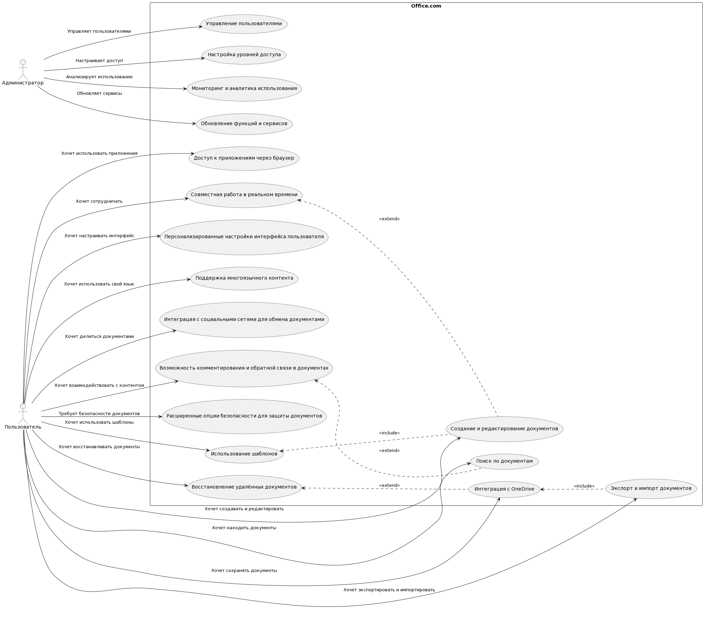
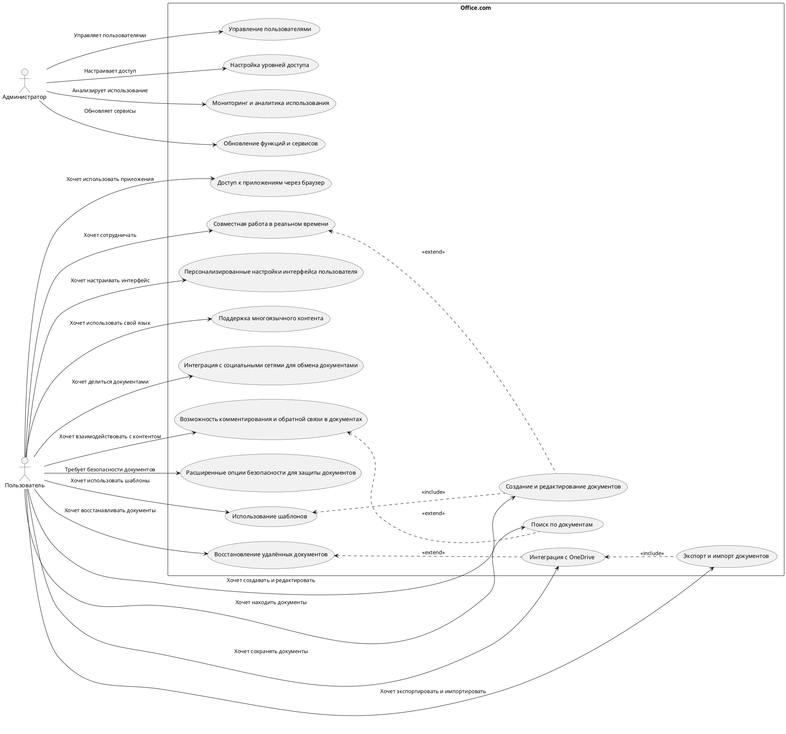

# Отчет

[Документ Software Requirements Specification, содержащий список требований к сайту](srs.md)

Исходный код диаграммы

```plantuml
@startuml
left to right direction
skinparam packageStyle rectangle
actor "Пользователь" as User
actor "Администратор" as Admin

rectangle "Office.com" {
    usecase "Доступ к приложениям через браузер" as UC1
    usecase "Совместная работа в реальном времени" as UC2
    usecase "Интеграция с OneDrive" as UC3
    usecase "Персонализированные настройки интерфейса пользователя" as UC4
    usecase "Поддержка многоязычного контента" as UC5
    usecase "Интеграция с социальными сетями для обмена документами" as UC6
    usecase "Возможность комментирования и обратной связи в документах" as UC7
    usecase "Расширенные опции безопасности для защиты документов" as UC8
    usecase "Управление пользователями" as UC9
    usecase "Настройка уровней доступа" as UC10
    usecase "Мониторинг и аналитика использования" as UC11
    usecase "Обновление функций и сервисов" as UC12
    usecase "Создание и редактирование документов" as UC13
    usecase "Экспорт и импорт документов" as UC14
    usecase "Поиск по документам" as UC15
    usecase "Использование шаблонов" as UC16
    usecase "Восстановление удалённых документов" as UC17

    User --> UC1 : Хочет использовать приложения
    User --> UC2 : Хочет сотрудничать
    User --> UC3 : Хочет сохранять документы
    User --> UC4 : Хочет настраивать интерфейс
    User --> UC5 : Хочет использовать свой язык
    User --> UC6 : Хочет делиться документами
    User --> UC7 : Хочет взаимодействовать с контентом
    User --> UC8 : Требует безопасности документов
    User --> UC13 : Хочет создавать и редактировать
    User --> UC14 : Хочет экспортировать и импортировать
    User --> UC15 : Хочет находить документы
    User --> UC16 : Хочет использовать шаблоны
    User --> UC17 : Хочет восстанавливать документы

    Admin --> UC9 : Управляет пользователями
    Admin --> UC10 : Настраивает доступ
    Admin --> UC11 : Анализирует использование
    Admin --> UC12 : Обновляет сервисы

    UC2 <.. UC13 : <<extend>>
    UC3 <.. UC14 : <<include>>
    UC7 <.. UC15 : <<extend>>
    UC16 <.. UC13 : <<include>>
    UC17 <.. UC3 : <<extend>>
}
@enduml

```
